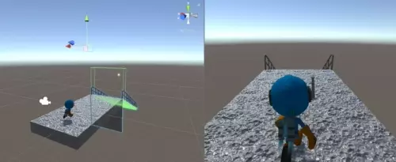
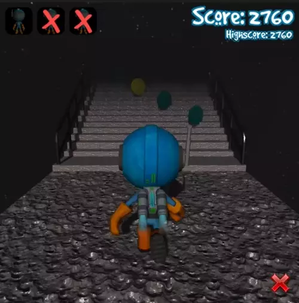

# Endless Runner
L'obiettivo del progetto era quello di riportare nella Realtà Aumentata un endless game già realizzato e funzionante in Unity utilizzando AR Foundation.

## Implementazione

Funzionalità già implementate nel gioco:

- Menù di gioco
- Movimento orizzontale WASD
- Salto, rotazione, lancio abilità e score
- Generazione nuove piattaforme
- Eliminazione piattaforme
- Restart game

Il video seguente mostra la generazione continua del mondo:

Esempio del gioco:

Funzionalità da noi implementate: 
- Swipe per il movimento orizzontale e per il salto
- Double Tap per l’abilità
- Divisione in zone per la rotazione

Soluzioni per portare il gioco in Realtà Aumentata:

- Utilizzare le coordinate della piattaforma iniziale come punto di partenza per la generazione del mondo
- Resize intero mondo e player
- Fermare la generazione dei piani per evitare sovrapposizione plane e piattaforme
- Aggiunta di un piano per triggerare la morte
- Rilancio AR Session dopo che il player muore ma ha ancora vite a disposizione

Inoltre è stato risolto il bug del gioco originale relativo alla possibiltà di saltare più volte.

Esempio gioco in realtà aumentata:

